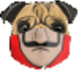

<h1>La Casa Do Dog</h1>

Primeiro projeto realizado, porém não tinha sido finalizado. 
Agora, retorno a este projeto, para finalizar. 
O primeiro commit, foi só para puxar os arquivos.

<h4>Commit Att-1</h4>

Commit para atualizar algumas coisas, foi retirado a página onde ficavam os Cachorros Quente, deixando tudo numa única página.

Basicamente, refatorando o código e eliminando alguns itens desnecessários e padronizando outros. Vou tentar explicar melhor cada tarefa feita nos próximos commits.

